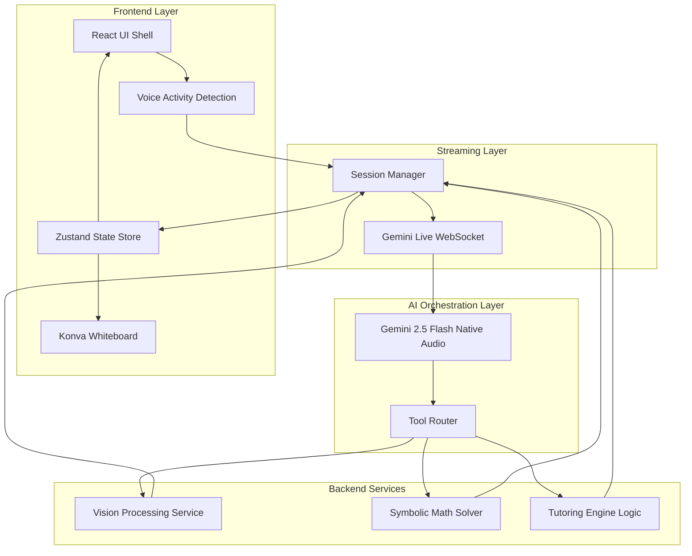

# VisionTutor AI: Redesigned Architecture

This document outlines the proposed high-performance, modular architecture for VisionTutor AI.

## 1. System Pipeline Diagram

## 2. Layer Responsibilities

### AI Orchestration Layer (The "Brain")
- **Responsibility**: Manages the state machine of the tutoring session.
- **Implementation**: A dedicated `TutorEngine` class that handles tool routing, consistency checks, and history summarization.

### Math Solver Service
- **Responsibility**: Symbolic computation and step generation.
- **Implementation**: Decoupled from the AI, using `mathjs` and `nerdamer` on the server-side to ensure 100% accuracy.

### Vision Processing Service
- **Responsibility**: Frame analysis, OCR, and layout detection.
- **Implementation**: A pipeline that uses `Tesseract.js` but adds a "Frame Quality Gate" to only process high-confidence frames.

### Tutoring Engine
- **Responsibility**: Pedagogical logic (Socratic method vs Direct instruction).
- **Implementation**: Driven by the `StudentProfile` and `SessionConfig`.

### Streaming Layer
- **Responsibility**: Real-time audio/video synchronization.
- **Implementation**: `GeminiLiveService` refactored into a `SessionManager` that handles reconnection and binary streaming.

### Frontend State Architecture
- **Responsibility**: Unidirectional data flow.
- **Implementation**: `Zustand` store to manage session state, whiteboard steps, and UI feedback.

## 3. Benefits of this Architecture

1. **Scalability**: Services (Math, Vision) can be moved to dedicated microservices if load increases.
2. **Low Latency**: Local OCR and VAD reduce the amount of data sent to the AI, while the `SessionManager` ensures gapless audio playback.
3. **Modularity**: The UI is decoupled from the AI logic. You can swap the AI model or the math engine without rewriting the frontend.
4. **Maintenance**: Clear separation of concerns makes it easier to debug specific parts of the pipeline (e.g., "Why is OCR slow?" vs "Why is the AI giving wrong hints?").
